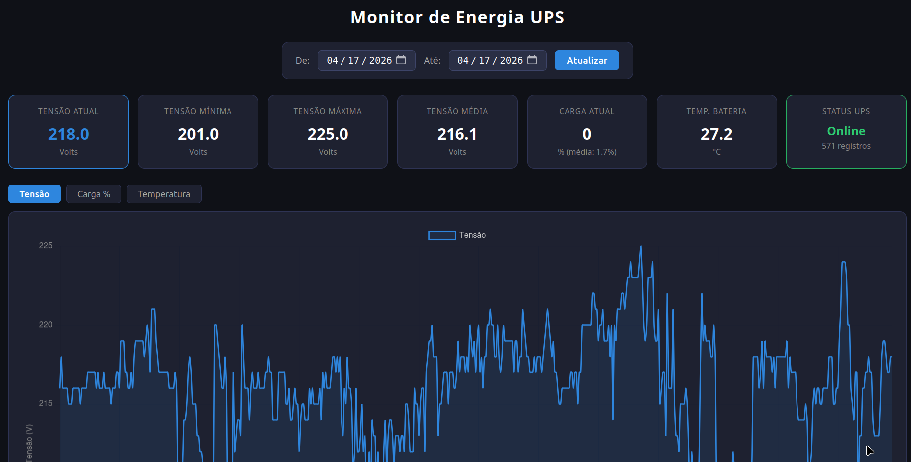

# Monitor de Energia UPS

Dashboard web para monitoramento em tempo real de nobreaks (UPS), exibindo tensão, carga e temperatura da bateria.

## Screenshot



## Como funciona

O frontend lê os dados de `data.txt`, gerado automaticamente via crontab no servidor:

```cron
0 7 * * * /usr/bin/upslog -i 60 -s myups -l /home/user/git/power_front/data.txt -f "\%TIME @Y,@m,@d; @H,@M,@S\%; \%VAR battery.charge\%; \%VAR input.voltage\%; \%VAR battery.voltage\%; \%VAR ups.status\%; \%VAR ups.load\%"
```

- `upslog` (NUT — Network UPS Tools) coleta métricas do UPS a cada 60 segundos e grava direto em `data.txt`
- O frontend lê `data.txt` e renderiza os gráficos e cards de métricas

## Funcionalidades

- Métricas em tempo real: tensão atual, mínima, máxima e média
- Carga da bateria e temperatura
- Status online/offline do UPS
- Gráficos históricos por período (Tensão, Carga %, Temperatura)
- Filtro por intervalo de datas

## Tecnologias

- React + TypeScript
- Recharts (gráficos)
- Dark theme
