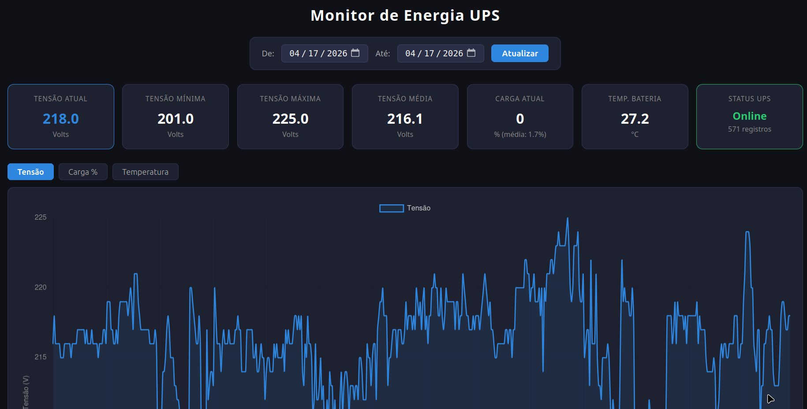

# Monitor de Energia UPS

Dashboard web para monitoramento em tempo real de nobreaks (UPS), exibindo tensão, carga, uso, autonomia e tensão da bateria.

## Screenshot



## Como funciona

O frontend lê os dados de `data/data.txt`, gerado automaticamente via crontab no servidor:

```cron
0 7 * * * /usr/bin/upslog -i 60 -s myups -l /home/user/git/power_ups_front/data/data.txt -f "\%TIME @Y,@m,@d; @H,@M,@S\%; \%VAR battery.charge\%; \%VAR input.voltage\%; \%VAR battery.voltage\%; \%VAR ups.status\%; \%VAR ups.load\%; \%VAR battery.runtime\%"
```

- `upslog` (NUT — Network UPS Tools) coleta métricas do UPS a cada 60 segundos e grava direto em `data/data.txt`
- O frontend lê `data/data.txt` e renderiza os gráficos e cards de métricas

O caminho do arquivo pode ser alterado pela variável `UPS_DASHBOARD_DATA_FILE`.

## Organização do projeto

```text
.
├── app.py                         # Entrada Flask/WSGI
├── power_ups_dashboard/           # Código e templates da aplicação
│   ├── ups_data.py
│   └── templates/dashboard.html
├── data/                          # Logs locais do UPS
│   ├── data.txt
│   └── legacy-data.txt
├── docs/assets/                   # Imagens usadas na documentação
└── docs/legacy/                   # Arquivos antigos mantidos como referência
```

## Formato esperado do log

Cada linha do arquivo precisa ter os campos abaixo, separados por `;`, nesta ordem:

```text
data; hora; battery.charge; input.voltage; battery.voltage; ups.status; ups.load; battery.runtime
```

Exemplo de linha:

```text
2026,04,27; 09,30,00; 100; 221.0; 28.4; OL; 0; 5001
```

O campo `battery.runtime` vem do `upsc myups` e representa a autonomia estimada em segundos. O frontend converte esse valor para horas/minutos.

No crontab, os sinais `%` precisam estar escapados com `\`:

```cron
0 7 * * * /usr/bin/upslog -i 2 -s myups -l /home/vitor/logreal.log -f "\%TIME @Y,@m,@d; @H,@M,@S\%; \%VAR battery.charge\%; \%VAR input.voltage\%; \%VAR battery.voltage\%; \%VAR ups.status\%; \%VAR ups.load\%; \%VAR battery.runtime\%"
```

Para testar manualmente no terminal, use o mesmo formato sem escapar `%`:

```bash
/usr/bin/upslog -i 2 -s myups -l /home/vitor/logreal.log -f "%TIME @Y,@m,@d; @H,@M,@S%; %VAR battery.charge%; %VAR input.voltage%; %VAR battery.voltage%; %VAR ups.status%; %VAR ups.load%; %VAR battery.runtime%"
```

## Funcionalidades

- Métricas em tempo real: tensão atual, mínima, máxima e média
- Carga da bateria, uso atual e autonomia estimada
- Tensão da bateria
- Status online/offline do UPS
- Gráficos históricos por período (Tensão, Uso %, Bateria V)
- Filtro por intervalo de datas

## Tecnologias

- Flask
- Chart.js
- Dark theme
